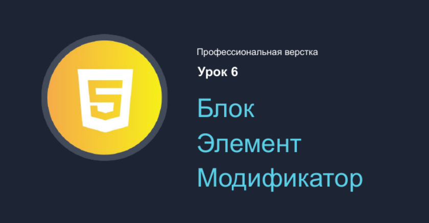

### Темы :

1. Что такое **БЭМ** ?

2. Пример БЭМ в HTML .

3. БЛОК .

   - Какие стили можно добавлять БЭМ блоку а какие нельзя ( для блока ).
   - Вложенности блоков .
   - Свободное перемещение блоков .
   - Повторное использование блоков .

4. ЭЛЕМЕНТ .
   - Про разделение слов в названиях классов .
   - Когда создавать БЛОК а когда ЭЛЕМЕНТ ?
   - Необязательносить элементов .
   - Вложенность элементов
   - Вложенная “ плоская” структура элементов .
   - Принадлежность элементов .
5. МОДИФИКАТОР .

   - Особенности модификатора .
   - Тип модифиатора — Булевый .
   - Тип модифиатора — ”ключ_значение” .
   - Принципы работы с модификаторами .

6. Использование БЭМ в проекте без БЭМ ( _начало работы с БЭМ_ ).
7. Файловая структура Flat .
8. Файловая структура Flex .
9. Почему "link" для стилей, в теге "head" страницы, лучше делать один в проекте ?
10. Микс БЭМ Блок + Элемент .

---
