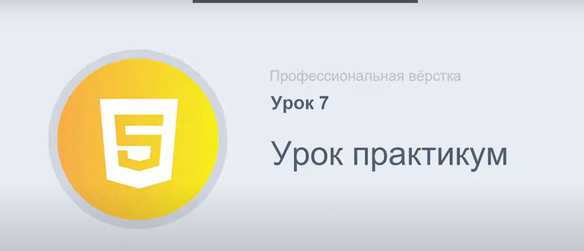

## Урок - практикум.

Практическая вёрстка с макета с использованием : bootstrap, препроцессора , БЭМ-методологии и других изученных способов вёрстки и технологий.

### Темы :

1. Папка blocks , в проекте ( для хранения css/scss файлов ).

2. Bootstrap Медиа запросы.

3. SCSS файлы в папке проекта blocks.

4. БЭМ-миксы на практике.

5. Margin ( и другие стили ) для БЭМ блоков.

6. И другое...

---
